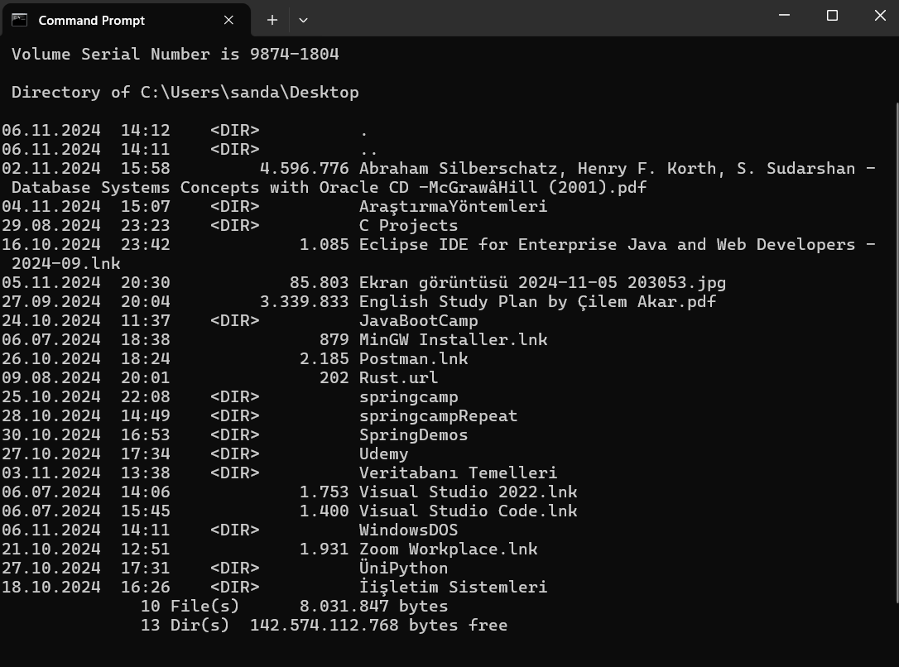

   

</br>

# Windows DOS Komutlarına Giriş 💻
<p>
  MS-DOS, bilgisayarlar üzerinde temel işlemleri komut satırında gerçekleştirebilmek için kullanılan bir işletim sistemidir. Bu rehberde, bazı temel MS-DOS komutlarını ve kullanım şekillerini bulacaksınız.
</p>

</br>

### `dir`
**Klasör İçeriğini Listeleme**  
Bu komut, içinde bulunduğunuz dizindeki dosyaları ve klasörleri listeler. En sonda bulduğu sonuçların sayısını en aşağıda döndürür

```dos
dir

``` 
 
 </br>

MS-DOS, bilgisayarlar üzerinde temel işlemleri komut satırında gerçekleştirebilmek için kullanılan bir işletim sistemidir. Bu rehberde, bazı temel MS-DOS komutlarını ve kullanım şekillerini bulacaksınız.

