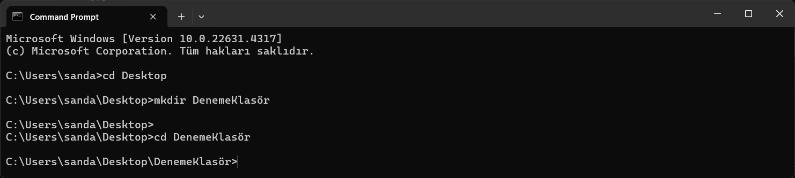
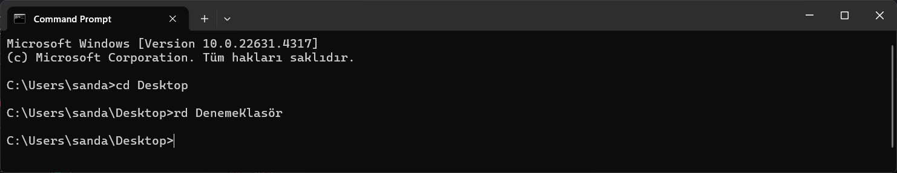
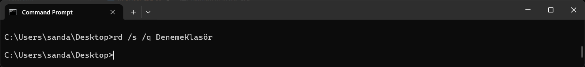
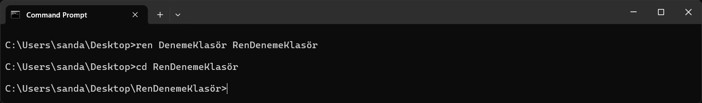
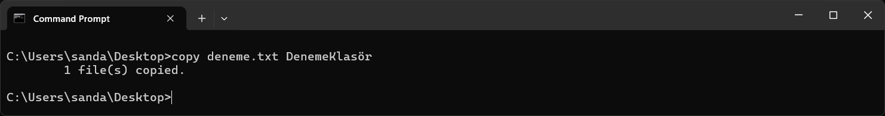
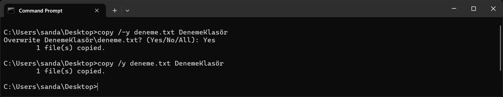
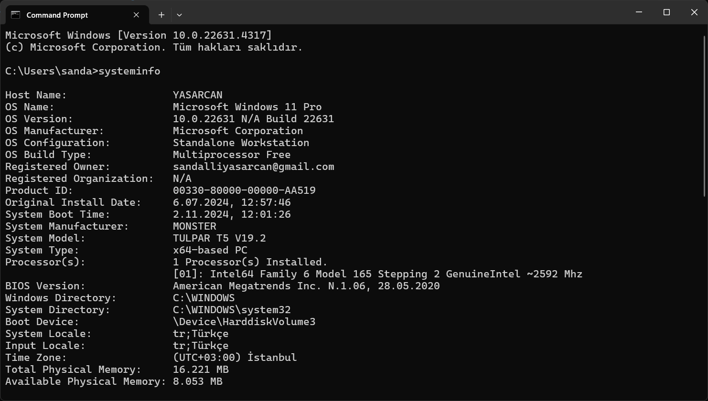
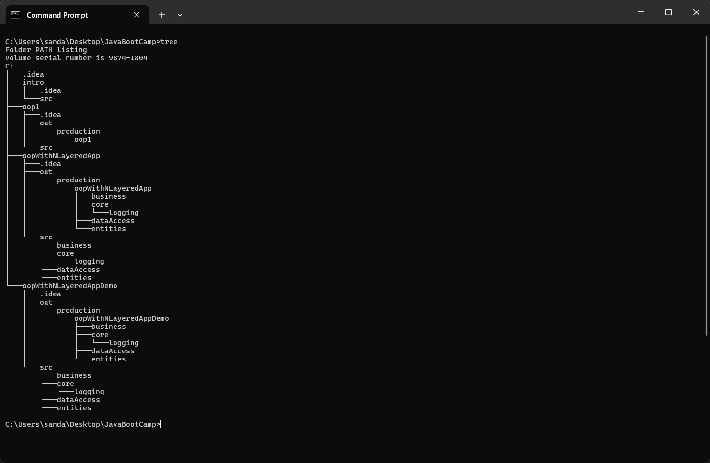
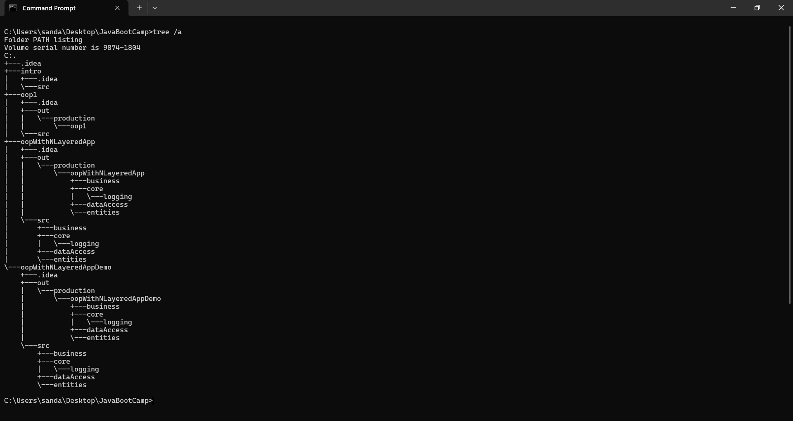

   

# Windows DOS Komutlarına Giriş 💻
<p>
  MS-DOS, bilgisayarlar üzerinde temel işlemleri komut satırında gerçekleştirebilmek için kullanılan bir işletim sistemidir. Bu rehberde, bazı temel MS-DOS komutlarını ve kullanım şekillerini bulacaksınız.
</p>

</br>

## `dir`

**Klasör İçeriğini Listeleme**  
Bu komut, içinde bulunduğunuz dizindeki dosyaları ve klasörleri listeler. En sonda bulduğu sonuçların sayısını en aşağıda döndürür

```dos
dir
```


* `dir /a` Parametresi ile gizli dosyalar dahil tüm dosyalari listeleyebilirisiniz

```dos
dir /a
```


<!--dir a-->

* `dir /ah` Parametresi ile sadece gizli doyaları ve klasörleri listeleyebilirsiniz

```dos
dir /ah
```


<!--dir b-->

* `dir /b` Parametresi ile sadece dosya ve klasör adlarını görebilirsiniz; ek bilgi içermez ve listelemede minimum bilgi sağlar.

```dos
dir /b
```


<!--dir d-->

* `dir /d` Dosya ve klasör adlarını geniş biçimde, köşeli parantezler içinde ekranda listeler

```dos
dir /d
```


<!--dir s-->

* `dir /s` Dizini ve o dizine air tüm alt dizinlerdeki dosyaları da listeler.

```dos
dir /s
```


## `cd`

**Klasör Değiştirme (Change Directory)**  
Bu komut, bulunduğunuz bir klasorden(veya bir dizinden) başka bir klasöre (dizine) geçmenizi sağlar. Klasör arası geçiş için kullanılır

```dos
cd
```


* `cd ..` Mevcut bir dizinden bir üst dizine geçmek için kullanılrı

```dos
cd ..
```


 * `cd [dizin]` Belirtilen dizine geçer. Eğer tam yol yazılırsa (örneğin, C:\Klasor\AltKlasor), komut doğrudan o dizine gider. Aksi takdirde, belirtilen dizin mevcut çalışma dizininin alt klasörü olarak değerlendirilir.

```dos
cd [dizin]
```


  __Ek Bilgi__: cd ..\ [dizin] şeklinde cd komutunun bir dizine geçme kodu ile bir alt klasör gitme kodu kombolanabilir !

 * `cd \` Kök (root) dizinine geçer. Yani, şu anki sürücünün en üst dizinine gider.

```dos
cd \
```


 * `cd \d [dizin]` Farklı bir sürücüdeki dizine geçiş yapmayı sağlar. Normal cd komutunda yalnızca aynı sürücüdeki dizinler arasında geçiş yapılabilir, ancak /d parametresi ile sürücü değiştirerek belirtilen dizine gidilebilir.

```dos
cd \d [D:\Projeler]
```
 _Uyari!_ Burada köşeli parantez içinde verilen dizin örnek amaçlıdır


|Parametre  |Açıklama |
|-----------|---------|
|`cd [dizin]`|Belirtilen dizine geçiş yapar.|
|`cd ..`  |Bir üst dizine çıkar.|
|`cd \`|Kök dizine geçiş yapar.|
|`cd /d [dizin]`|Sürücüyü değiştirerek belirtilen dizine gider.|

</br>

## `cls`

**Konsol Ekranını Temizleme**  
Bu komut, terminalde daha önce yazılan tüm kodları temizleyerek temiz bir sayfa görünümü sağlar. Konsola cls komutu çalıştrılıkdıktan sonra en tepe mevcut dizin klasorü vardır

```dos
cls
```


## `mkdir` ya da `md`

**Yeni Bir Dosya Oluşturma (Make Directory)**  
Bu komutlar, mevcut dizinde yeni bir klasör oluşturmak için kullanılır kullanimi şu şekildedir `mkdir [Klasör_Adı]` 
_Not :_ Bu komut birden fazla klsörde oluşturabilir `mkdir klasör1 klasör2 klasör3` gibi

```dos
mkdir [Klasö_Adı]
```

```dos
md [Klasör_Adı]
```




## `rd`

**Klasörleri Silmek (Remove Directory)** </br>
Bu komut daha önce var bir veya birden fazla klasörü silmek için kullanılır rd komutunun yanına yazılan her klasör adı kalıcı olarak silinir

```dos
rd [Klasör_Adı]
```


* `rd /s` Dizinin içindeki tüm dosyaları ve alt dizinleri (içeriğiyle birlikte) siler. Yani, dolu bir klasörü tamamen kaldırmak için kullanılır.

```dos
rd /s
```


* `rd /s /q` Sorgusuz mod (quiet mode) olarak çalışır. rd /S komutu ile birlikte kullanıldığında, dizini ve içeriğini silerken onay istemez. Bu, dizini sessizce silmek için kullanışlıdır.

```dos
rd /s /q
```


|Parametre  |Açıklama |
|-----------|---------|
|`rd [dizin_adi]`|Belirtilen dizini siler (boş olmalı)|
|`/S`  |Dizini ve içeriğini (alt dizinler ve dosyalar) siler|
|`/Q`|Onay istemeden silme işlemini gerçekleştirir (quiet mode).|

</br>

## `ren` ya da `rename`
**Yeniden İsimlendirme (Rename)** </br>
Bu komut bir dosyayı ya da klasörü yeniden isimlendirmek için kullanılır komut yazıldıktan sonra ismi değiştirilmek istenin dosyanın adı sonrasında da yeni adı yazılır

```dos
ren [Klasör_Adı] [Klasörün_Yeni_Adı]
```


## `copy`
**Kopyalama** </br>
 Bu komut, dosyaları bir konumdan başka bir konuma kopyalamak için kullanılır.

```dos
copy [Kopyalanacak_Klasör_Adı] [hedef_dizin]
```



 * `copy *.txt C:\YeniKlasor\` Aynı uzantıya sahip dosyaları bir konumdan başka bir konuma kopyalamak için * joker karakteri kullanılabilir. 

```dos
copy *.txt [hedef_dizin]
```

 * `copy /y` Hedef dizinde aynı isimde bir dosya varsa üzerine yazılmasını sağlar ve onay istemez. 

```dos
copy /y dosya.txt [hedef_dizin]
```

 * `copy /-y` Hedef dizinde aynı isimde bir dosya varsa kullanıcıdan onay ister. 

```dos
copy /-y dosya.txt [hedef_dizin]
```



## `systeminfo`
**Sistem Bilgileri** </br>
Bu komut bilgisayarın sistem bilgilerini görüntülemek için kullanılır. komut, işletim sistemi sürümü, yüklü RAM miktarı, işlemci bilgisi, ağ yapılandırması gibi birçok ayrıntıyı listeler.

```dos
systeminfo
```


## `tree`
**Ağaç Görünümü** </br>
Bu komut  terminal satırında dizin yapısını görsel olarak (ağaç yapısında) listelemek için kullanılır. Bu komut sayesinde, belirli bir klasör ve alt klasörleri içerisindeki tüm dosya ve klasör yapısını hiyerarşik bir şekilde görebilirsiniz.

```dos
tree
```


 * `tree /f` Dizinlerin yanı sıra dizin içerisindeki dosyaları da listeler. Bu parametre olmadan yalnızca klasör isimleri görüntülenir. 

```dos
tree /f
```

* `tree /a` Ağaç yapısını oluştururken, ASCII karakterleri kullanır (bu, özellikle grafiksiz ekranlarda veya dışa aktarıldığında düzgün görüntülenmesi için yararlıdır). Normalde Windows, grafiksel çizgiler kullanır.

```dos
tree /a
```

