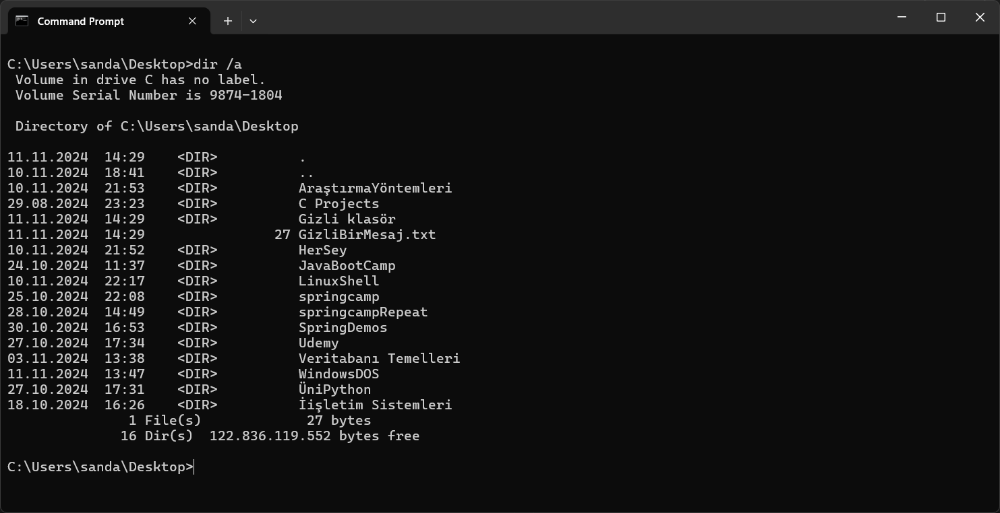
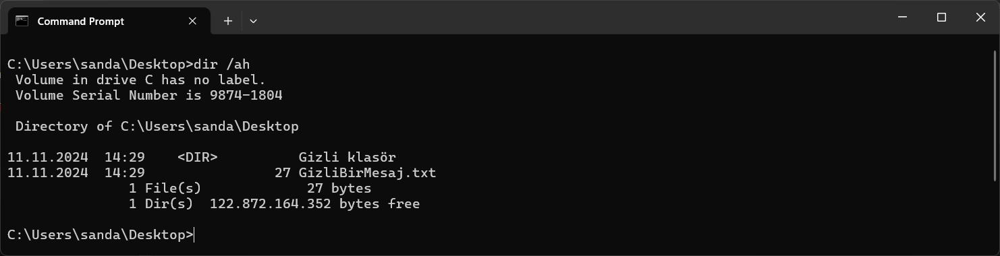
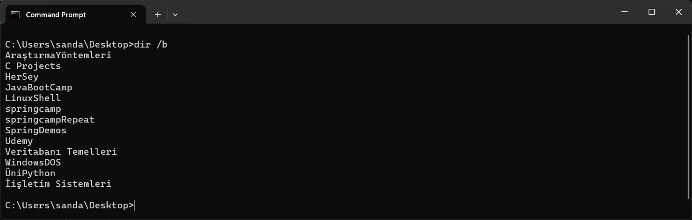
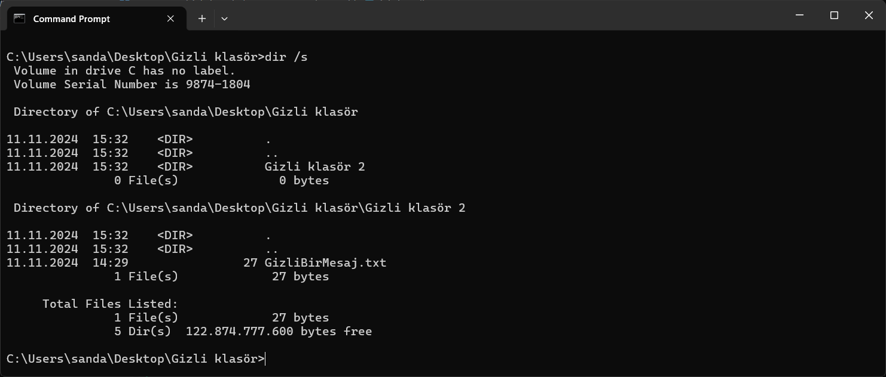
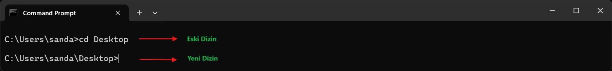
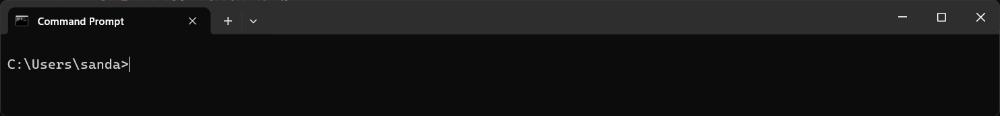

   

# Windows DOS Komutlarına Giriş 💻
<p>
  MS-DOS, bilgisayarlar üzerinde temel işlemleri komut satırında gerçekleştirebilmek için kullanılan bir işletim sistemidir. Bu rehberde, bazı temel MS-DOS komutlarını ve kullanım şekillerini bulacaksınız.
</p>

</br>

## `dir`

**Klasör İçeriğini Listeleme**  
Bu komut, içinde bulunduğunuz dizindeki dosyaları ve klasörleri listeler. En sonda bulduğu sonuçların sayısını en aşağıda döndürür

```dos
dir
```


* `dir /a` Parametresi ile gizli dosyalar dahil tüm dosyalari listeleyebilirisiniz

```dos
dir /a
```




<!--dir a-->

* `dir /ah` Parametresi ile sadece gizli doyaları ve klasörleri listeleyebilirsiniz

```dos
dir /ah
```


<!--dir b-->

* `dir /b` Parametresi ile sadece dosya ve klasör adlarını görebilirsiniz; ek bilgi içermez ve listelemede minimum bilgi sağlar.

```dos
dir /b
```


<!--dir d-->

* `dir /d` Dosya ve klasör adlarını geniş biçimde, köşeli parantezler içinde ekranda listeler

```dos
dir /d
```


<!--dir s-->

* `dir /s` Dizini ve o dizine air tüm alt dizinlerdeki dosyaları da listeler.

```dos
dir /s
```



## `cd`

**Klasör Değiştirme (Change Directory)**  
Bu komut, bulunduğunuz bir klasorden(veya bir dizinden) başka bir klasöre (dizine) geçmenizi sağlar. Klasör arası geçiş için kullanılır

```dos
cd
```


* `cd ..` Mevcut bir dizinden bir üst dizine geçmek için kullanılrı

```dos
cd ..
```


 * `cd [dizin]` Belirtilen dizine geçer. Eğer tam yol yazılırsa (örneğin, C:\Klasor\AltKlasor), komut doğrudan o dizine gider. Aksi takdirde, belirtilen dizin mevcut çalışma dizininin alt klasörü olarak değerlendirilir.

```dos
cd [dizin]
```


  __Ek Bilgi__: cd ..\ [dizin] şeklinde cd komutunun bir dizine geçme kodu ile bir alt klasör gitme kodu kombolanabilir !

 * `cd \` Kök (root) dizinine geçer. Yani, şu anki sürücünün en üst dizinine gider.

```dos
cd \
```


 * `cd \d [dizin]` Farklı bir sürücüdeki dizine geçiş yapmayı sağlar. Normal cd komutunda yalnızca aynı sürücüdeki dizinler arasında geçiş yapılabilir, ancak /d parametresi ile sürücü değiştirerek belirtilen dizine gidilebilir.

```dos
cd \d [D:\Projeler]
```
 _Uyari!_ Burada köşeli parantez içinde verilen dizin örnek amaçlıdır


|Parametre  |Açıklama |
|-----------|---------|
|`cd [dizin]`|Belirtilen dizine geçiş yapar.|
|`cd ..`  |Bir üst dizine çıkar.|
|`cd \`|Kök dizine geçiş yapar.|
|`cd /d [dizin]`|Sürücüyü değiştirerek belirtilen dizine gider.|


## `cls`

**Konsol Ekranını Temizleme**  
Bu komut, terminalde daha önce yazılan tüm kodları temizleyerek temiz bir sayfa görünümü sağlar. Konsola cls komutu çalıştrılıkdıktan sonra en tepe mevcut dizin klasorü vardır

```dos
cls
```
